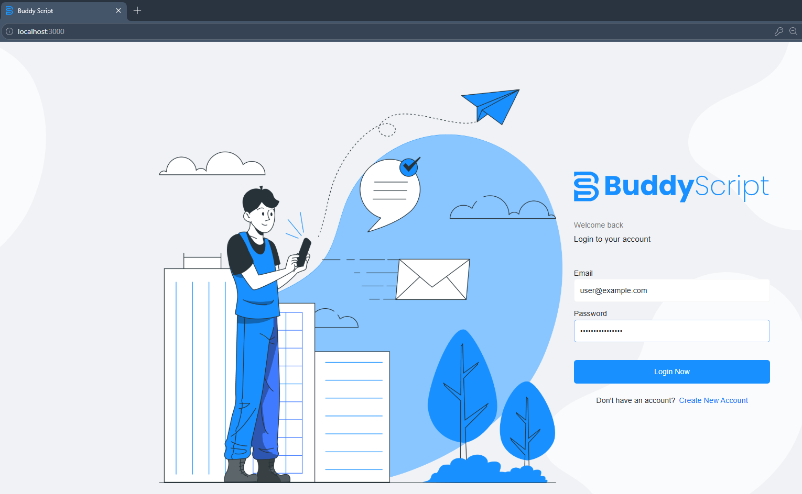
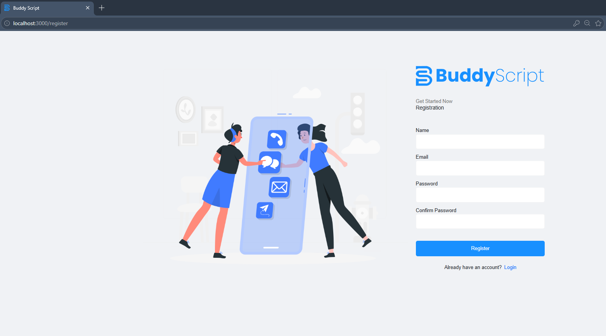
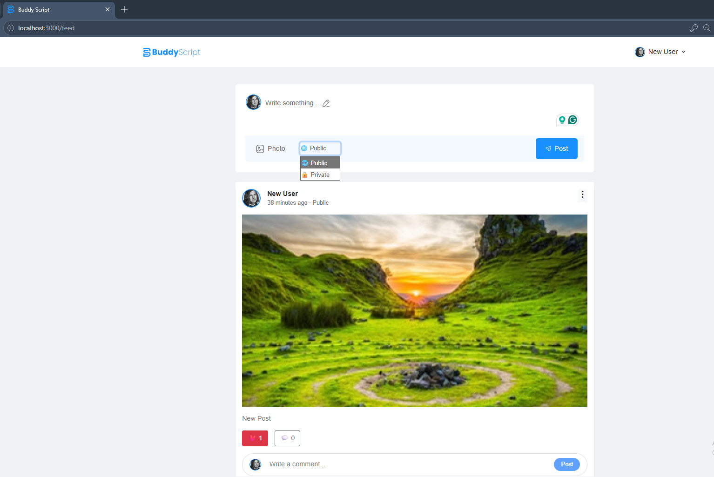
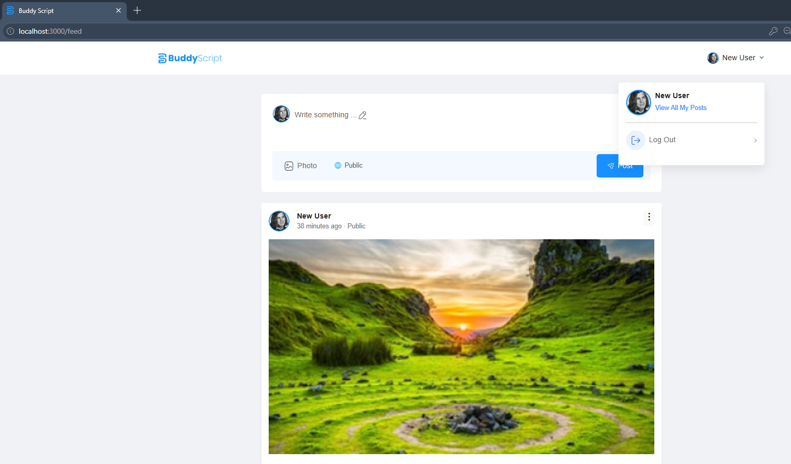
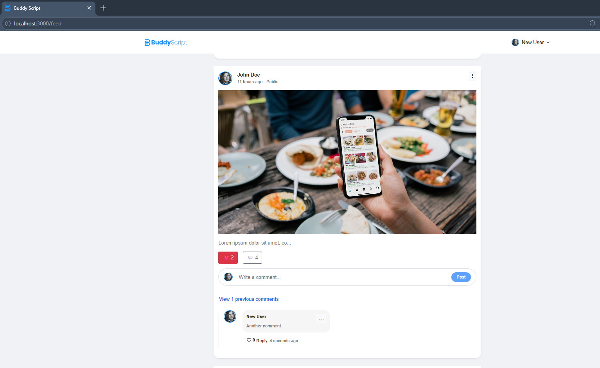
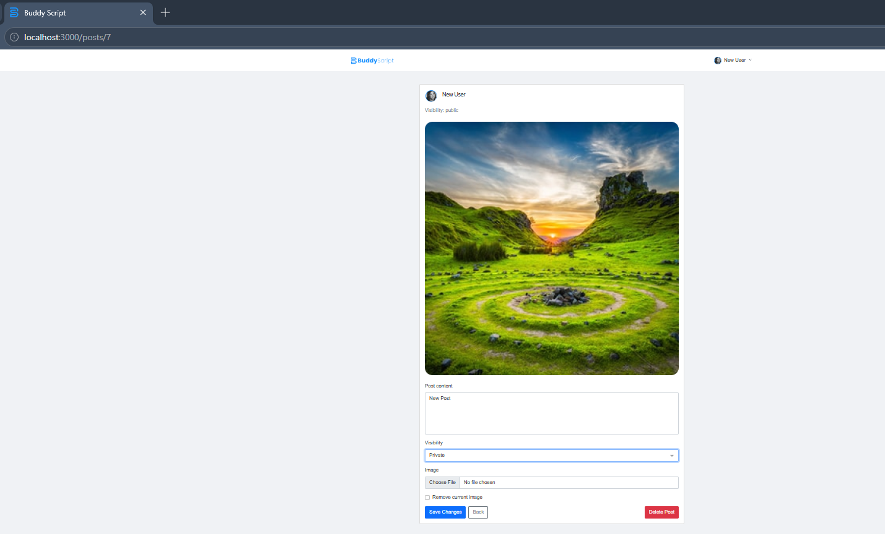
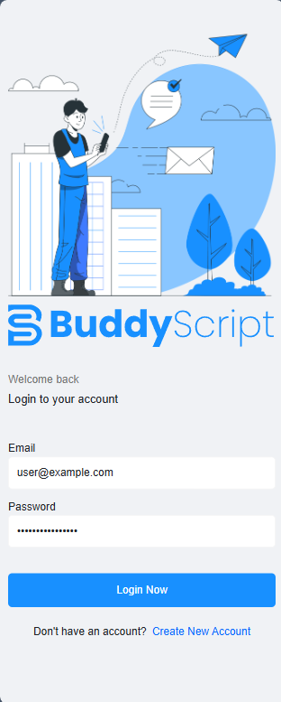
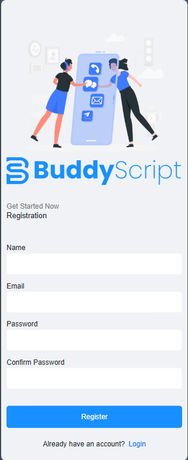
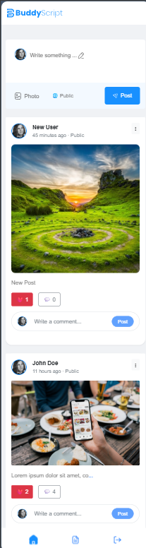
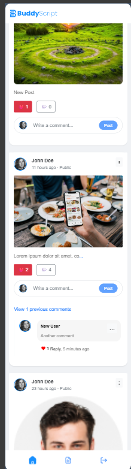

# BuddyScript


BuddyScript is a modern full-stack social media application built with **Laravel** and **React**. It enables users to register, authenticate, create posts with images, interact through likes, comments, and replies, and explore a personalized social feed.

The application follows a RESTful API architecture with Laravel powering the backend and React delivering a fast, responsive frontend experience.

---

## 📸 Screenshots


### Login



### Register



### Feed





### Edit Post



### Mobile View







---

# ✨ Features

### Authentication

- User registration
- User login & logout
- Protected routes
- Laravel Sanctum authentication

### Feed

- Create text posts
- Upload images with posts
- Public and private posts
- News feed sorted by newest first
- Responsive feed layout

### Social Interaction

- Like and unlike posts
- Comment on posts
- Reply to comments
- Like and unlike comments
- View who liked a post or comment

### User

- View own posts
- Search posts
- Profile information

### UI

- Mobile responsive design
- Modern React interface
- Fast page navigation with React Router

---

# 🛠 Tech Stack

## Backend

- PHP 8.2+
- Laravel 12
- Laravel Sanctum
- MYSQL Database
- Eloquent ORM
- REST API

## Frontend

- React 19
- Vite
- React Router DOM
- Axios

---

# 📁 Project Structure

```text
buddyScript/

├── backend/
│   ├── app/
│   ├── database/
│   ├── routes/
│   ├── storage/
│   └── ...
│
└── frontend/
    ├── public/
    ├── src/
    │   ├── components/
    │   ├── pages/
    │   ├── layouts/
    │   ├── services/
    │   └── ...
    └── ...
```

---

# 🚀 Getting Started

## Prerequisites

Make sure you have installed:

- PHP 8.2+
- Composer
- Node.js 18+
- npm

---

# 📥 Installation

## Clone the repository

```bash
git clone https://github.com/TasinTausif/buddyScript.git

cd buddyScript
```

---

## Backend Setup

```bash
cd backend

cp .env.example .env

composer install

php artisan key:generate

php artisan migrate

php artisan storage:link
```

---

## Frontend Setup

```bash
cd ../frontend

npm install
```

---

# ⚙ Environment Variables

### Backend (.env)

```env
APP_NAME=BuddyScript

APP_URL=http://127.0.0.1:8000

DB_CONNECTION=mysql
DB_HOST=127.0.0.1
DB_PORT=3306
DB_DATABASE=buddy_script
DB_USERNAME=
DB_PASSWORD=
```

### Frontend (.env)

```env
VITE_API_URL=http://127.0.0.1:8000/api
```

Adjust these values according to your local environment.

---

# ▶ Running the Application

## Start Laravel Backend

```bash
cd backend

php artisan serve
```

---

## Start React Frontend

```bash
cd frontend

npm run dev
```

---

## Or run Laravel development server

```bash
cd backend

composer run dev
```

---

# 🔄 Application Architecture

```text
React Frontend
       │
       ▼
Axios HTTP Client
       │
       ▼
Laravel REST API
       │
       ▼
Laravel Eloquent ORM
       │
       ▼
MYSQL Database
```

---

# 📌 API Overview

## Authentication

| Method | Endpoint |
|---------|----------|
| POST | `/api/register` |
| POST | `/api/login` |
| POST | `/api/logout` |
| GET | `/api/me` |

---

## Posts

| Method | Endpoint |
|---------|----------|
| GET | `/api/feed` |
| POST | `/api/posts` |
| GET | `/api/posts/{post}` |
| PUT | `/api/posts/{post}` |
| DELETE | `/api/posts/{post}` |
| GET | `/api/my-posts` |
| GET | `/api/posts/search` |

---

## Comments

| Method | Endpoint |
|---------|----------|
| POST | `/api/posts/{post}/comments` |
| PUT | `/api/comments/{comment}` |
| DELETE | `/api/comments/{comment}` |

---

## Likes

| Method | Endpoint |
|---------|----------|
| POST | `/api/posts/{post}/like` |
| POST | `/api/comments/{comment}/like` |

---

# 📱 Responsive Design

BuddyScript is fully responsive and optimized for:

- 💻 Desktop
- 💻 Laptop
- 📱 Mobile devices

---

# 🔒 Authentication

Authentication is implemented using **Laravel Sanctum**, ensuring secure API access for authenticated users while protecting private routes.

---

# 👨‍💻 Author

**Tasin Tausif**

GitHub: https://github.com/TasinTausif

---

# 📄 License

This project is licensed under the MIT License.
